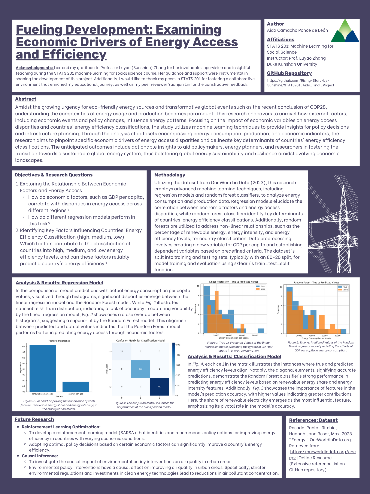

# Fueling Development: Examining Economic Drivers of Energy Access and Efficiency
## Project Information

- **Author**: Aida Camacho Ponce de Leon, Computation & Design with a track in Social Policy, Class of 2026, Duke Kunshan University.

- **Instructor**: Professor Luyao Zhang, Duke Kunshan University

- **Disclaimer**: Submissions to the Final Project for STATS 201: Introduction to Machine Learning for Social Science at Duke Kunshan University.

- **Acknowledgments**: I extend my sincere gratitude to Professor Luyao (Sunshine) Zhang for her invaluable supervision
and insightful teaching during the STATS 201 machine learning for social science course. Her guidance and support were
instrumental in shaping the development of this project. Additionally, I would like to express my thanks to my peers in
STATS 201 for fostering a collaborative environment that greatly enriched my educational journey.

- **Project Summary**:

  <kbd>
    
  </kbd>

*Figure 1: Map of the research proposal. Created with Whimsical*

### Background/Motivation
This research explores the intricate relationship between economic factors and energy efficiency using machine learning techniques. By analyzing data on energy consumption, production, and economic indicators, we aim to uncover patterns and insights that can inform policy decisions and infrastructure planning efforts. Our study addresses pressing questions about disparities in energy access and the determinants of countries' energy efficiency classifications. Through this research, we seek to contribute to the transition towards a sustainable global energy system. *Figure 1* shows a detailed flowchart of this summary, providing an overview of the research proposal.

While previous studies have examined energy consumption trends across different regions and countries, there is still a need for a more thorough analysis considering economic development levels and geographical regions. Additionally, understanding the specific impact of economic factors on energy access disparities and efficiency classifications remains an ongoing challenge in the literature. Furthermore, existing literature lacks a comprehensive understanding of how economic factors influence energy access and efficiency. Our research fills this gap by employing advanced machine learning techniques to analyze large datasets and uncover nuanced relationships.

### Research Questions
The research aims to answer the following questions:

- RQ1: How do economic factors such as GDP per capita correlate with energy access disparities across different regions?
- RQ2: What factors contribute to the classification of countries into high, medium, and low energy efficiency levels, and can these factors be used to predict a country's energy efficiency?

### Questions Significance

1. **Understanding the Relationship Between Economic Factors and Energy Access Disparities:**
   - Economic factors, such as GDP per capita, play a crucial role in determining the level of energy access within different regions. Higher GDP per capita generally indicates greater purchasing power and infrastructure development, which often leads to improved access to energy resources. Conversely, regions with lower GDP per capita tend to face challenges in accessing modern energy services, leading to disparities in energy access.
   - By analyzing the correlation between economic factors like GDP per capita and energy access disparities across regions, policymakers can identify patterns and understand the underlying drivers of energy poverty. This understanding can inform targeted interventions aimed at improving energy access for marginalized communities.

2. **Factors Influencing Energy Efficiency Levels and Predictive Modeling:**
   - Energy efficiency is influenced by a multitude of factors, including technological advancements, policy frameworks, investment in clean energy infrastructure, and behavioral patterns of consumption.
   - By examining the factors contributing to the classification of countries into high, medium, and low energy efficiency levels, researchers can identify key determinants that influence a country's overall energy efficiency performance. These determinants can include government policies promoting renewable energy adoption, investment in energy-efficient technologies, public awareness campaigns, and regulatory frameworks incentivizing energy conservation.
   - Utilizing predictive modeling techniques, such as machine learning algorithms, researchers can develop models that predict a country's energy efficiency based on relevant factors identified through empirical analysis. These predictive models can assist policymakers in forecasting future energy efficiency trends and designing targeted policies to enhance energy efficiency levels.

### Application Scenarios
The transition towards eco-friendly energy sources, coupled with global events like COP28, underscores the urgency of understanding energy patterns. This research aims to unravel the impact of economic variables on energy access and efficiency, addressing critical gaps in existing literature and offering insights into sustainable energy practices.

### Methodology
**Data Source and Datasets:**
Using the dataset on energy consumption and production by the scientific online site Our World in Data (2023), the research will integrate external datasets related to economic indicators, policy changes, and global events. The dataset provides a comprehensive overview of global energy dynamics, including variables related to energy consumption, production, and environmental impact. For example, country names, years, population, GDP, biofuel consumption, coal usage, gas consumption, nuclear power, oil consumption, hydropower, low-carbon energy, renewables, and others (Rosado et.al, 2023). Data preprocessing techniques will be employed to handle missing values and to filter only the necessary data.

**Machine Learning Algorithms:**
This research will employ advanced machine learning algorithms, including regression models and random forest classifiers, for analysis. The regression models will elucidate the relationship between economic factors and energy access disparities, while random forest classifiers will discern the key determinants of countries' energy efficiency classifications.

**Software and Computing Platforms:**
Python is the primary programming language, leveraging data analysis libraries such as Pandas and NumPy.

### Results
Anticipated outcomes include identifying specific economic factors influencing energy access disparities and elucidating the pivotal determinants of countries' energy efficiency classifications. These findings are poised to inform policy decisions, infrastructure planning endeavors, and risk management strategies, thereby facilitating the transition toward a sustainable and secure global energy system.

**Policy Implications and Recommendations:**
   - Based on the findings from this analysis of economic factors and energy access disparities,  policymakers can prioritize investment in energy infrastructure development in regions with low GDP per capita to improve energy access and alleviate energy poverty.
   - Furthermore, policymakers can design inclusive policies that ensure equitable distribution of energy resources, particularly targeting underserved communities and rural areas.
   - Informed by the factors influencing energy efficiency levels, governments can implement comprehensive energy efficiency strategies encompassing regulatory measures, financial incentives, and public awareness campaigns.
   - Collaboration between governments, scientists, and the private sector is essential to drive innovation in clean energy technologies and facilitate the transition towards a more sustainable and energy-efficient future.
   - Empowering the general public through education and awareness programs can foster behavioral changes conducive to energy conservation and efficiency.

By integrating insights from both research questions, policymakers can formulate evidence-based policies that address energy access disparities while promoting sustainable energy practices and enhancing overall energy efficiency levels on a global scale. This holistic approach is crucial for achieving energy security, mitigating climate change impacts, and fostering inclusive economic development.

### Intellectual Merits/Practical Impacts
By enhancing our understanding of the intricate dynamics between economic variables and energy-related outcomes, this research endeavors to furnish policymakers, energy planners, and researchers with actionable insights to devise adaptive strategies, formulate inclusive policies, and design resilient energy infrastructures. Ultimately, this endeavor aims to contribute towards fostering global energy sustainability and resilience in the face of evolving economic landscapes and shifting global paradigms.

    

*Figure 1: Poster of the Research Project. Created with Canva*

## Table of Contents
1. [Project Summary](./README.md#project-information)
   - Summarize the Background/Motivation
   - Research Questions
   - Application Scenario (Data Source)
   - Methodology
   - Results
   - Intellectual Merits and Practical impacts of your project.
   - Research Poster

2. [Literature](literature/Readme.md)
   - [1.1. Paper Analysis](./literature/Readme.md#11-paper-analysis)
      - Background/Motivation
      - Research Question
      - Application Scenarios
      - Methodology
      - Results
      - Intellectual Merits/Practical Impacts
      - [Connection to the Research Idea](./literature/Readme.md#connection-between-current-literature-and-project-idea)
      - References

3. [Method](method/README.md)
   - [The Prediction Problem](./method/README.md#11-the-prediction-problem)
      - [Prediction Task Workflow](./method/README.md#prediction-task-workflow)
      - [Research Question Formulation](./method/README.md#research-question-formulation)
      - [Operational Measures](./method/README.md#operational-measures) 
      - [Hypothesis Development](./method/README.md#hypothesis-development)
   - [The Machine Leaning Workflow](./method/README.md#12-the-machine-learning-workflow)
      - [Model Development](./method/README.md#model-development) 
      - [Results Presentation](./method/README.md#results-presentation)
      - [Model Evaluation](./method/README.md#model-evaluation)   
      
4. [Data](data/README.md)
   - [Queried data](./data/Queried_data)
   - [Data Description](./data/README.md)
      - [Dataset Sturcture flowchart](./data/README.md#dataset-structure)
      - [Data Dictionary](./data/README.md#data-dictionary)
   - [Processed data](./data/Processed_data)

5. [Code](code/README.md)
   - [Data Query Process Description](./code/README.md#data-query)
      - [App of visualization 1](./code/README.md#visualization-1)
      - [App of visualization 2](./code/README.md#visualization-2)
      - [App of visualization 3](./code/README.md#visualization-3)
      - [Pseudo-code](./code/README.md#data-query-process-pseudo-code)
      - [Flowchart](./code/README.md#data-query-flowchart)
      - [References](./code/README.md#references)
   - [Data Query code](./code/data_query)
   - [Data Analysis](./code/data_analysis)
      - [Regression Data Processing and Analysis](./code/data_analysis/Analysis_Processing_Regression.ipynb)
      - [Classification Data Processing and Analysis](./code/data_analysis/Analysis_Processing_Classification.ipynb)

6. [Results](results/README.md)

7. [Future Research Directions](future_research/README.md)
   - [Causal Inference Research Summary](./future_research/README.md#1-causal-inference-research-idea)
   - [Optimization Research Summary](./future_research/README.md#2-optimization-research-idea)
   
8. [Spotlights](spotlights/README.md)
   - Visualizations

9. [More about the Author](about_the_author/README.md)
   - Headshot
   - Bio and Resume
   - Intellectual growth
   - Professional growth
   - Living a purposeful life