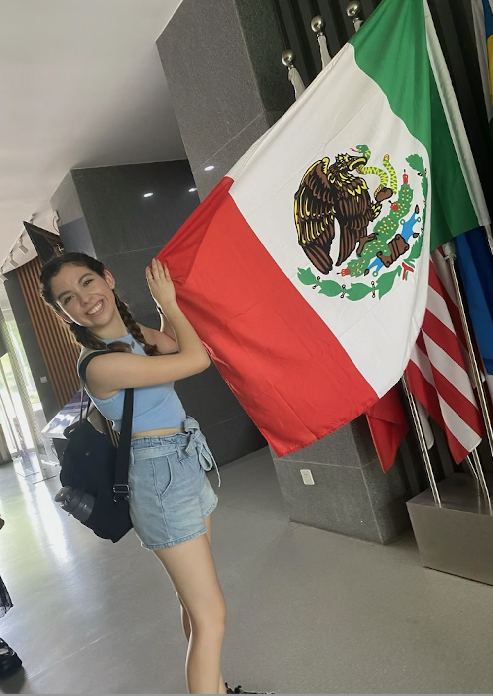

# About the Author

  <kbd>
    
  </kbd>

## Aida Camacho Ponce de León 👩‍💻🌎

Hi! I'm Aida, originally from 🇲🇽 Mexico. I am form the class of 2026 at Duke Kunshan University. My major is Computation & Design with a track in Social Policy. Academically speaking, I have a deep passion for 💻📚 computational and statistical applications to social science issues, particularly 🌱 environmental policy. I am greatly interested in the intersection between computational and statistical sciences and social science. 

Personally speaking, I find joy in learning new languages and 🌐 connecting with people from diverse parts of the world, embracing various cultures along the way 🌟.

Currently at DKU, I am on a journey to challenge myself academically, socially, and personally.

## Final Reflection:

**Intellectual Growth:**
Throughout this course, I experienced significant intellectual growth as I delved into the application of machine learning to address social and economic issues. Initially, I possessed a foundational understanding of computational and statistical techniques but lacked insight into their potential impact on societal challenges. However, through engaging with course materials, discussions, and practical projects, I developed a deeper appreciation for the merits of applying machine learning in the context of social science. Furthermore, collaborating with peers from diverse backgrounds and classes allowed me to gain new perspectives and insights, fostering creative problem-solving approaches. This course not only broadened my academic horizons but also enriched my understanding on how to be a pioneer and of the significance of the intersection between machine learning/ data science and the social sciences to solve real-world issues. 

**Professional Growth:**
Professionally, this course facilitated my growth by equipping me with a versatile skill set and fostering the development of a professional profile tailored to addressing societal challenges. I honed my technical skills in machine learning algorithms, data analysis, and model interpretation, gaining proficiency in applying these tools to real-world datasets. Moreover, engaging in collaborative projects and discussions enhanced my communication and teamwork abilities, essential for effective interdisciplinary collaboration. As a result, I emerged from this course with a holistic understanding of how computational and statistical methods can be leveraged to inform evidence-based policy decisions and drive positive societal change.

**Living a Purposeful Life:**
Looking ahead, I aspire to be recognized as a pioneering figure at the intersection of computational sciences and social policy, leveraging innovative approaches to address pressing environmental challenges. My vision is to contribute to advancing human civilization by developing data-driven solutions that promote environmental sustainability and social equity. If awarded the Nobel Prize or Turing Award one day, my feature sentence would highlight my dedication to harnessing the power of computational and statistical sciences to drive positive societal impact.
