# CODE: Data Query

This section describes the data query and data analysis process.

## Description

Refer to [*Figure 7*](/code/README.md#Data-Query-flowchart) for the flow chart of this step by step explanation of the data query process. 
**Step 1**

The data was downloaded from Our World in Data, a scientific online publication focusing on large global problems such as poverty, disease, hunger, climate change, war, existential risks, and inequality (Roser, n.d.). This specific dataset was found under the topic of [Energy](https://ourworldindata.org/energy). The following is the description of the page:

> The world lacks a safe, low-carbon, and cheap large-scale energy infrastructure.
>
> Until we scale up such an energy infrastructure, the world will continue to face two energy problems: hundreds of millions of people lack access to sufficient energy, and the dominance of fossil fuels in our energy system drives climate change and other health impacts such as air pollution.
>
> To ensure everyone has access to clean and safe energy, we need to understand energy consumption and its impacts around the world today and how this has changed over time.
>
> On this page, you can find all our data, visualizations, and writing relating to energy. 
(Rosado, et.al, 2023)

  <kbd>
    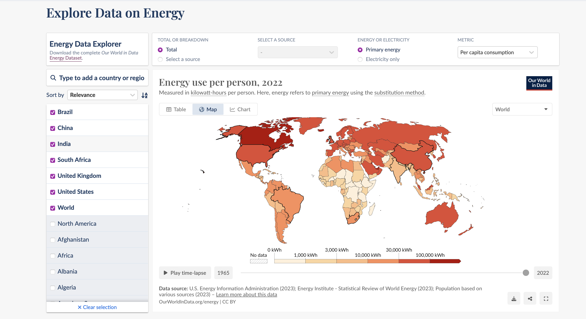
  </kbd>

*Image created by OWID*

**Step 2**

All code from Our World in Data is open-sourced under the MIT license and can be found on GitHub. Thus, I downloaded the data and codebook directly from their official [Github repository](https://github.com/owid/energy-data/blob/master/README.md). 

  <kbd>
    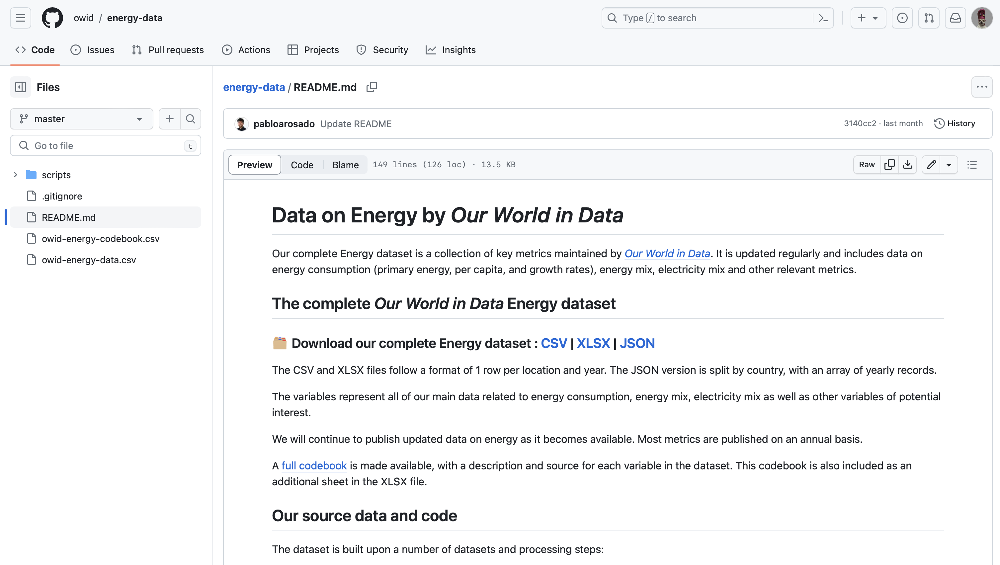
  </kbd>

*Image created by OWID*

The data downloaded was already orginized in a CSV file.

**Step 3**

Looking at the data in the csv file, it is clear that the data needs to be cleaned to remove null values focusing on the research question at hand. For this, the plan is to use python libraries such as Pandas. Chech the data [data processing notebook](./data_analysis/Data_Processing_Regression.ipynb) for a step by step process of how the data was cleaned. 
Check the [data analysis notebook](/data_analysis/Data_Analysis_Regression.ipynb) for the code for the prediction task. Also, check [data processing and analysis notebook](./data_analysis/Analysis_Processing_Classification.ipynb) for the classification model.

# Data Visualization

### Visualization 1
The data visualization was done using the dash app. This [file](./data_query/app1.py) contians the code to run the interactive plot of a Time Series analysis of Energy Production including, total electricity generation, from fossil fuels, and from renewables. Below are the static plots of these variables throughout time for the US. The reason why only teh US is shown is because there are a lot of locations repreesnted in the dataset and the visualization of only one major power is enough to get an idea of waht the raw data shows. To interact with the plot, run the code on your local computer. Alternatively, go to this [Google Colab](https://colab.research.google.com/drive/1danKQTxQ5RsbSFg-0PJWhEhdRlR1jZqT?usp=sharing) to interact with the plot.

Variables: electricity_generation, renewables_electricity, and fossil_electricity, year, country = US

  <kbd>
    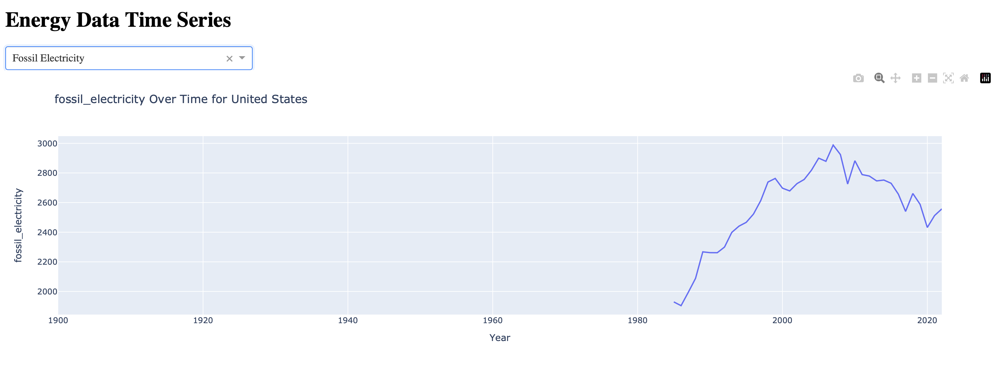
  </kbd>

*Figure 1: Electricity produced in the US by Fossil Fuels thourhgout time. Image created with Dash app*

  <kbd>
    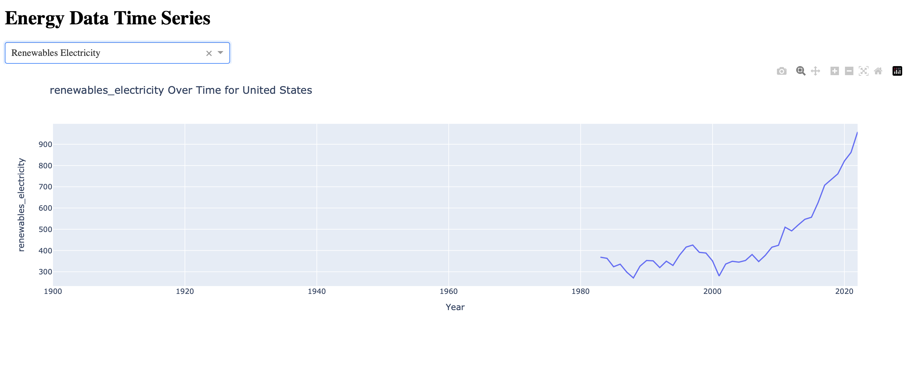
  </kbd>

*Figure 2: Electricity produced in the US by Renewable sources throughout time. Image created with Dash app*

  <kbd>
    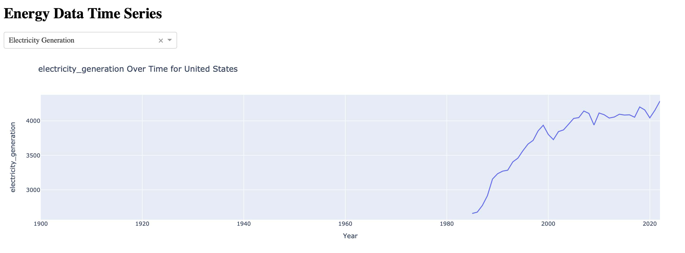
  </kbd>

*Figure 3: Total Electricity produced in the US throughout time. Image created with Dash app*

### Visualization 2
This [file](./data_query/app2.py) contians the code to run the interactive plot of a Global Distribution Choropleth Map that explores how different countries contribute to energy production. Alternatively, go to this [Google Colab](https://colab.research.google.com/drive/1xJ69o6yf3ww4jucHsBnAQGiYUPdj1jWc?usp=sharing) to interact with the plot.

Variables: country, population, electricity_generation

  <kbd>
    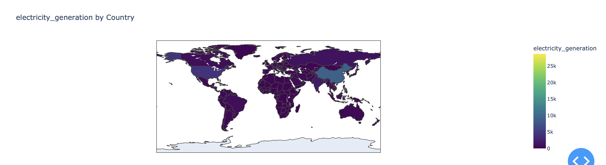
  </kbd>

*Figure 4: Total Electricity produced in different countries. Image created with Dash app*

### Visualization 3
This [file](./data_query/app3.py) contians the code to run the interactive plot of Anomaly Detection to identify anomalies or changes in energy consumption patterns. Alternatively, go to this [Google Colab](https://colab.research.google.com/drive/1SSkIpLYBewnOZaXM9qjeW7d6ijQCQej6?usp=sharing) to interact with the plot.

Variables: energy_cons_change_pct, renewables_cons_change_pct, countries, year

  <kbd>
    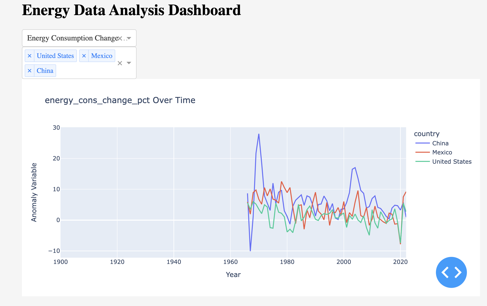
  </kbd>

*Figure 5: Energy Consumption Change Percentage. Image created with Dash app*

  <kbd>
    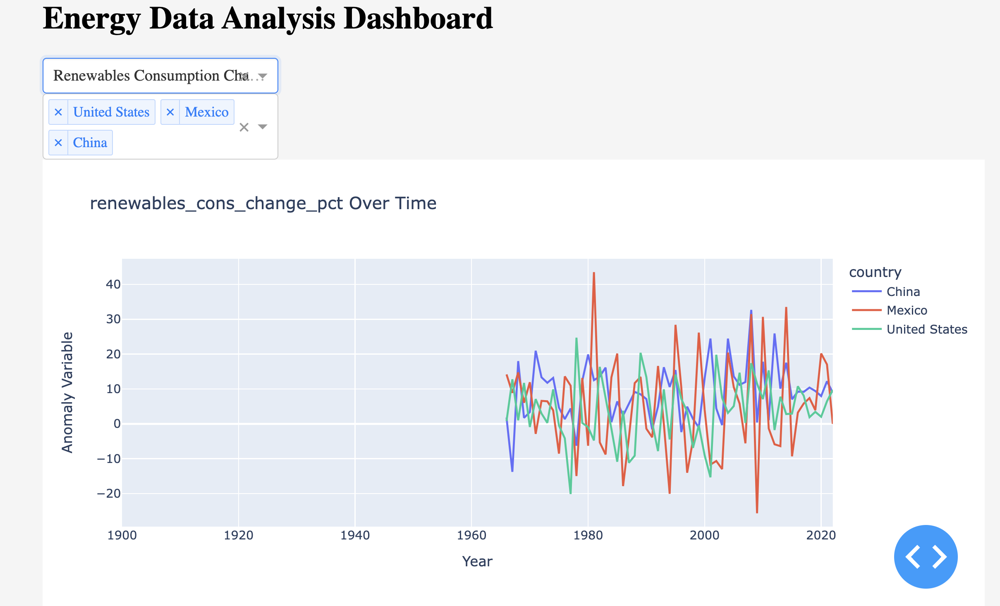
  </kbd>

*Figure 6: Renewables Consumption Change Percentage. Image created with Dash app*

# Data Query Process (pseudo-code)
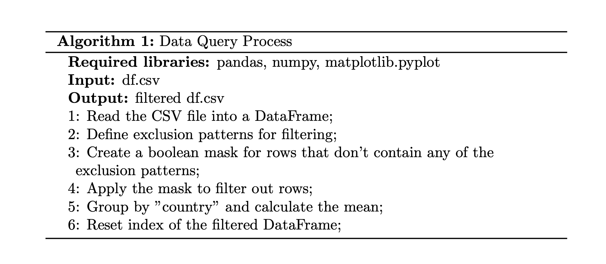

The following is a step by step table showing the rest of the process so far, including the Dash App visualizations 

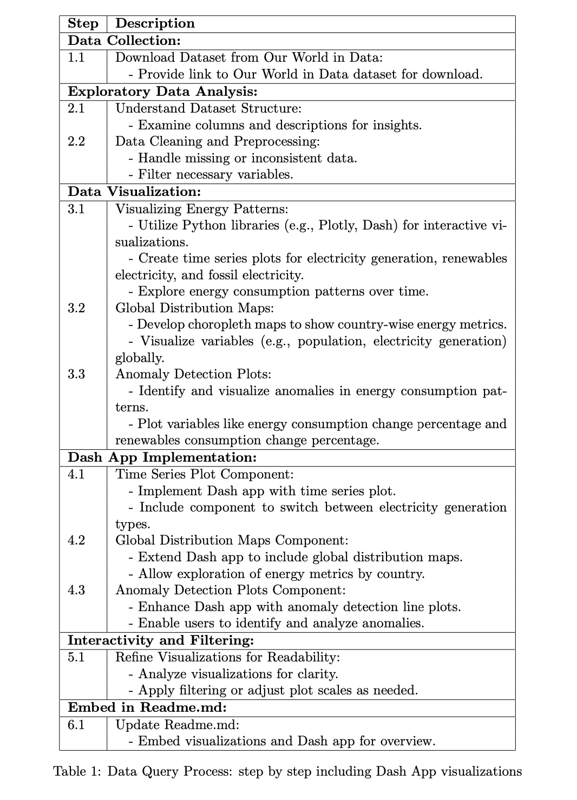

## Data Query flowchart

  <kbd>
    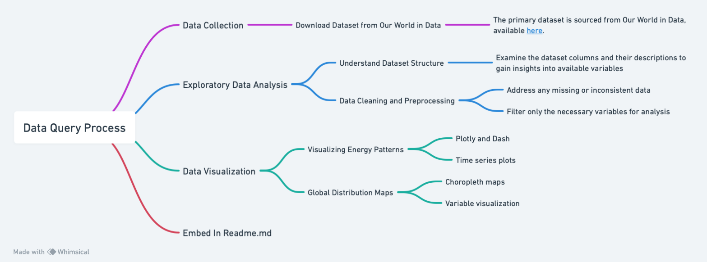
  </kbd>

*Figure 7: Flowchart of the Data Query process. Image created with Whimsical*

## References

Aydın, Celil, and Ömer Esen. 2018. “Does the Level of Energy Intensity Matter in the Effect of 
Energy Consumption on the Growth of Transition Economies? Evidence from Dynamic Panel Threshold Analysis.” Energy Economics 69 (January): 185–95. https://doi.org/10.1016/j.eneco.2017.11.010. 

“Measurements of Energy Access: A Better Way? - Energy for Growth Hub.” 2023. Energy for 
Growth Hub. June 12, 2023. https://energyforgrowth.org/article/measurements-of-energy-access-a-better-way/. 

Rosado, Pablo., Ritchie, Hannah., and Roser, Max. 2023. "Energy." OurWorldInData.org. Retrieved from 'https://ourworldindata.org/energy' [Online Resource].

Zabat, Lotfi Hocine, Naima Akli Sadaoui, Abid Mehdi, and Habib Sekrafi. 2022. “Threshold 
Effects of Renewable Energy Consumption by Source in U.S. Economy.” Electric Power Systems Research 213 (December): 108669. https://doi.org/10.1016/j.epsr.2022.108669.
