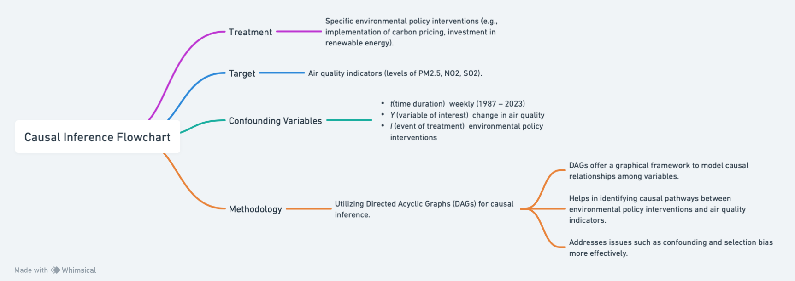
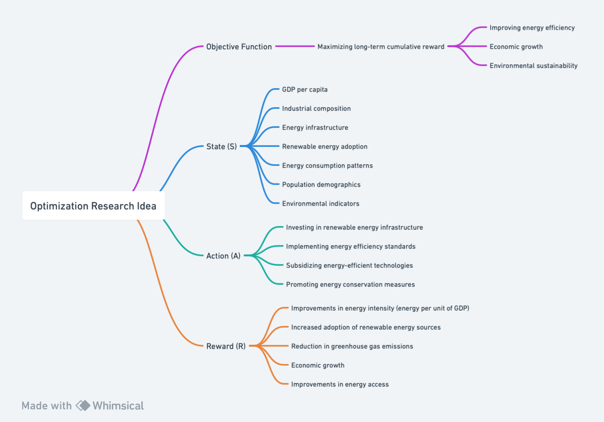

# FUTURE RESEARCH DIRECTIONS

The following page shows an outline of two research summaries using the causal inference methods and the optimization
methods.

# 1. Causal Inference Research Idea

  <kbd>
    
  </kbd>

*Figure 1: Flowchart of Design of a Machine Learning Problem for Causal Inference. Created with Whimsical* 

## Research Question Formulation:

### Objective:
To investigate the causal impact of environmental policy interventions on air quality in urban areas.

### Research Question: 
How can we leverage advanced causal inference methods to deepen our understanding of the causal impact of environmental policy interventions on air quality in urban areas?

### Background and Motivation:  
The causal relationship between environmental policy interventions and air quality in urban areas is a critical area of study with profound implications for public health and environmental sustainability. In fact, air pollution is “a risk factor for many of the leading causes of death including heart disease, stroke, lower respiratory infections, lung cancer, diabetes and chronic obstructive pulmonary disease (COPD)” (Ritchie and Roser, 2021). By exploring the causal mechanisms underlying policy interventions, this research can inform decision-makers and contribute to the development of more targeted and efficient environmental policies. Figure 2 shows a visual representation of the casual inference research design.

## Methods:
### Operational Measures:
- **Variables**:
    1. Independent Variable: Specific environmental policy interventions (for example, implementation of carbon pricing, investment in renewable energy).
    2. Dependent Variable: Air quality indicators (levels of PM2.5, NO2, SO2).
    - *t*(time duration) $\rightarrow$ weekly (1987 – 2023)
    - *Y* (variable of interest) $\rightarrow$ change in air quality
    - *I* (event of treatment) $\rightarrow$ environmental policy interventions
- **Data Type**:
    - Panel data. The dataset includes information on air quality measurements in different sites across the US over time (United States Environmental Protection Agency, 2023). 
- **Machine Learning Algorithm and Package Selection**:
    - For this research, the incorporation of advanced causal inference methods, specifically causal inference using Directed Acyclic Graphs (DAGs). DAGs offer a graphical framework for modeling causal relationships among variables and identifying causal pathways. By explicitly modeling the causal structure of our research question, DAGs can help address issues such as confounding and selection bias more effectively.
    - Pyhton Library: A Python library developed by Microsoft Research, `doWhy` offers a framework for causal inference using DAGs. It provides functionalities for causal effect estimation, sensitivity analysis, and identification of causal mechanisms.

## Potential Results
By incorporating DAGs into our analysis, we can not only estimate the causal effect of environmental policy interventions on air quality but also elucidate the underlying causal mechanisms and pathways through which these interventions operate. This deeper understanding can provide invaluable insights for policymakers and stakeholders in designing more targeted and effective environmental policies.
- Causal Hypothesis: Environmental policy interventions have a causal effect on improving air quality in urban areas. Specifically, stricter environmental regulations and investments in clean energy technologies lead to reductions in air pollutant concentrations (Chen et al. 2023).
    - Justification: This hypothesis is based on existing research showing correlations between environmental policies and improvements in air quality (Chen et al. 2023). Nonetheless, the previous literature misses to establish causality as establishing causality is essential for policy evaluation and decision-making. By leveraging machine learning techniques, we can analyze complex, non-linear relationships between policy interventions and air quality indicators while controlling for confounding variables, thus providing robust causal evidence.

## Contributions:

- **Intellectual Merits**: By integrating advanced causal inference methods such as DAGs into our research, we contribute to the methodological advancement of causal inference in environmental policy studies. This approach allows for a more rigorous examination of causal relationships and enhances the validity of our findings.
- **Practical Impacts**: Our research can directly inform policy decisions aimed at improving air quality in urban areas. By providing robust evidence of the causal impact of environmental policies, we empower policymakers to implement interventions that are more effective and tailored to specific environmental challenges.

## References:
Chen, Xihui Haviour, Kienpin Tee, Marwa Elnahass, and Rizwan Ahmed. 2023. "Assessing 
the environmental impacts of renewable energy sources: A case study on air 
pollution and carbon emissions in China." Journal of Environmental Management 
345: 118525. Accessed February 17, 2024.[https://doi.org/10.1016/j.jenvman.2023.118525](https://doi.org/10.1016/j.jenvman.2023.118525)

Hannah Ritchie and Max Roser. 2021. “Air Pollution: Our overview on both indoor and outdoor air pollution.” Our World in data. Retrieved from [https://ourworldindata.org/air-pollution](https://ourworldindata.org/air-pollution)

United States Environmental Protection Agency. 2023. “CASTNET Ozone Monitoring.” CSV. [https://awsedap.epa.gov/public/single/?appid=efa6d1bf-4cab-4e17-9e14-8046adfe9249&sheet=3495c3da-aca4-494b-a1d8-d6d6a0571cbc&opt=currsel%2ctxmenu&bookmark=ede040ab-190f-4827-8aa7-45890306ecf8.](https://awsedap.epa.gov/public/single/?appid=efa6d1bf-4cab-4e17-9e14-8046adfe9249&sheet=3495c3da-aca4-494b-a1d8-d6d6a0571cbc&opt=currsel%2ctxmenu&bookmark=ede040ab-190f-4827-8aa7-45890306ecf8.)

Pearl, J. (2009). Causality: Models, Reasoning, and Inference.
Hernán, M. A., & Robins, J. M. (2020). Causal Inference: What If.
Greenland, S., Pearl, J., & Robins, J. M. (1999). Causal diagrams for epidemiologic research.

# 2. Optimization Research Idea

  <kbd>
    
  </kbd>

*Figure 2: Flowchart of Optimization Research Idea. Created with Whimsical* 

## Research Question Formulation:

### Objective:
To develop a reinforcement learning model that identifies and recommends policy actions for improving energy efficiency in countries with varying economic conditions.
Specifically, the research aims to:
1.	Identify key features influencing countries' energy efficiency classification.
2.	Design and train a reinforcement learning agent to learn optimal energy efficiency policies based on observed state-action-reward transitions.
3.	Evaluate the effectiveness of the proposed framework in improving energy efficiency, economic growth, and environmental sustainability in developing countries.

### Background and Motivation:
Addressing energy access and sustainability in developing countries requires innovative policy decision-making approaches. While the proposed reinforcement learning framework aims to optimize energy efficiency policies, further advancements can enhance its efficacy and practical applicability. By integrating state-of-the-art reinforcement learning optimization methods, we can refine policy recommendations and provide more robust solutions to energy-related challenges.
This research is significant because it addresses the pressing global challenge of energy access and sustainability in developing countries. By leveraging reinforcement learning techniques, we aim to provide policymakers with data-driven insights and recommendations for designing effective energy efficiency policies tailored to the unique socio-economic contexts of different countries. The outcomes of this research could lead to tangible improvements in energy access, economic development, and environmental quality in developing regions, contributing to global efforts towards sustainable development goals.

### Research Questions:
- How can we leverage advanced reinforcement learning optimization methods to enhance the effectiveness and efficiency of energy efficiency policy decisions in developing countries?
- What are the potential impacts of integrating these methods into the existing reinforcement learning framework on energy efficiency and socio-economic development?

## Methods:
To advance the current research, we propose the incorporation of advanced reinforcement learning optimization methods, specifically SARSA (State-Action-Reward-State-Action) algorithm. SARSA is a model-free reinforcement learning algorithm that learns the optimal policy directly from interactions with the environment.

**Software Documentation**:
- TensorFlow or PyTorch: Deep learning frameworks for implementing neural networks.
- Stable Baselines3 or RLlib: Libraries that provide implementations of SARSA algorithm in Python.

**Reinforcement Learning Framework:**
- **Objective Function**: The objective function represents the goal of our reinforcement learning agent, which is to maximize energy efficiency while considering socio-economic factors. This function encapsulates the trade-offs between different policy actions to achieve optimal outcomes. It could be formulated as maximizing the long-term cumulative reward, where the reward is tied to improvements in energy efficiency, economic growth, and environmental sustainability.
- **State (S)**: The state represents the current socio-economic and energy-related conditions of a country. It includes features such as GDP per capita, industrial composition, energy infrastructure, renewable energy adoption, energy consumption patterns, population demographics, and environmental indicators. These features provide the context for the agent to make decisions regarding energy efficiency policies.
- **Action (A)**: The action space comprises the set of policy decisions available to the reinforcement learning agent. These actions correspond to various energy efficiency interventions that policymakers can implement, such as investing in renewable energy infrastructure, implementing energy efficiency standards, subsidizing energy-efficient technologies, promoting energy conservation measures, or restructuring energy pricing mechanisms.
- **Reward (R)**: The reward function evaluates the effectiveness of policy actions taken by the agent based on changes in energy efficiency and associated socio-economic outcomes. It could be defined to reflect improvements in energy intensity (energy per unit of GDP), increased adoption of renewable energy sources, reduction in greenhouse gas emissions, economic growth, or improvements in energy access. The reward function incentivizes actions that lead to positive outcomes while penalizing those that result in adverse effects or fail to improve energy efficiency.

## Potential Results:
Incorporating SARSA into our reinforcement learning framework can lead to several potential outcomes:
- Improved convergence and sample efficiency during policy optimization.
- Enhanced capability to handle high-dimensional state representations and complex policy decision spaces.
- More robust and effective policy recommendations tailored to the socio-economic contexts of developing countries.
- Insights into the interplay between different economic factors, policy actions, and energy efficiency outcomes.

## Contributions:
- **Intellectual Merits**: By integrating advanced reinforcement learning optimization methods, we advance the state-of-the-art in policy decision-making for energy efficiency. This approach enhances our understanding of how SARSA techniques can be applied to complex socio-economic problems and contributes to the broader research agenda on sustainable development.
- **Practical Impacts**: The adoption of SARSA-based optimization methods can lead to tangible improvements in energy access, economic development, and environmental sustainability in developing countries. Policymakers can benefit from more accurate, data-driven insights to design and implement effective energy efficiency policies, thereby addressing critical global challenges.

## References:
- Rummery, G. A., & Niranjan, M. (1994). On-line Q-learning using connectionist systems. Technical report, Cambridge University Engineering Department.
- Sutton, R. S., & Barto, A. G. (2018). Reinforcement learning: An introduction. MIT press.