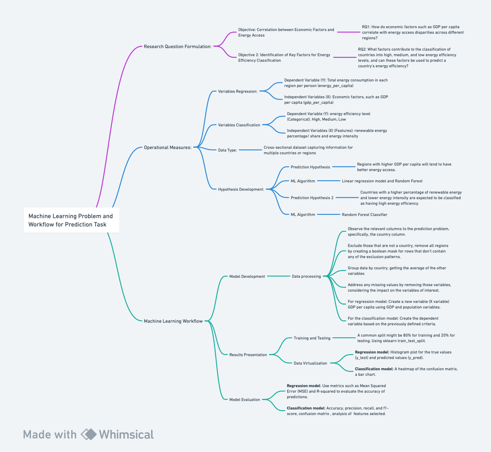

# METHOD

The following page shows the method and the workflow of the research on the prediciton problem. Namely, it includes the research questions and their significance, the hypothesis, operational measures and the detailed Machine Learning Workflow. 

# 1.1. The Prediction Problem

## Prediction Task Workflow 

  <kbd>
    
  </kbd>

*Figure 1: Flowchart  of the task and workflow. Created with Whimsical* 

## Research Question Formulation:

### Objective:
Exploring the Relationship Between Economic Factors and Energy Access

### RQ1: 
How do economic factors, such as GDP per capita, correlate with disparities in energy access across different regions?

### Significance:  
Energy access is intricately tied to economic development. Understanding the correlation between GDP per capita and energy access disparities is crucial for developing targeted interventions. Thus, examining the relationship between GDPs per capita with energy access disparities helps policymakers and researchers identify key drivers of inequality. This comprehension can guide policy decisions, directing attention towards inclusive economic growth and urban planning strategies that prioritize energy access. For instance, in their 2023 article titled "Inclusive Economic Growth: Relationship between Energy and Governance Efficiency", researchers Aleksy Kwilinski, Oleksii Lyulyov, and Tetyana Pimonenko argue that as the European Union (EU) is striving for carbon neutrality while promoting inclusive economic growth, to achieve this goal they need to implement effective incentives and initiatives. They argue that "energy sectors are the core determinant of inclusive economic growth", as traditional energy resources (coal) have a higher negative impact on nature and people’s well-being than on economic and social benefits (Kwilinski et.al, 2023).

### Objective 2: 
Identifying Key Factors Influencing Countries' Energy Efficiency Classification (high, medium, low)

### RQ2: 
Which factors contribute to the classification of countries into high, medium, and low energy efficiency levels, and can these factors reliably predict a country's energy efficiency?

### Significance:  
The primary objective is to develop a predictive model that leverages these factors influencing countries' energy efficiency classifications. The need for such research is connected to what was previously explained as determining which regions have lower efficiency levels and the reason why that is, could also encourage the development and implementation of effective incentives and initiatives that lead to such "inclusive economic growth"(Kwilinski et.al, 2023).Refer to *Figure 1* for an in-depth flowchart detailing this workflow.

## Operational Measures:

### Variables for Regression Model:

- **Dependent Variable (Y):** 
  Total energy consumption in each region per person (`energy_per_capita`).
  
- **Independent Variables (X):** 
  Economic factors, such as GDP per capita (`gdp_per_capita`).
  
- **Data Type:** 
  The dataset is a cross-sectional dataset that captures information for multiple countries or regions.

### Variables for Classification Model:

- **Dependent Variable (Y):** 
  Energy efficiency level (Categorical). High, Medium, Low (This variable is created based on a researched cutting point for the levels of energy, more on this later).
  
- **Independent Variables (X) (Features):** 
  - Renewable energy percentage/share (`renewables_share_elec`): Percentage of total energy derived from renewable sources.
  - Energy intensity (`energy_per_gdp`): Energy consumption per unit of GDP, indicating the efficiency of energy use in the economy.
  
## Hypothesis Development:

### Prediction Hypothesis for Regression:
Regions with higher GDP per capita will tend to have better energy access, whereas those with lower economic indicators may face greater energy access disparities.

- **Justification:** 
This hypothesis is rooted in the notion that economic development, indicated by higher GDP per capita, is typically associated with enhanced infrastructure and energy access. Wealthier and more developed regions often possess the resources to invest in energy infrastructure, thereby mitigating access disparities. Professor Kelsey Jack from the University of California, Santa Barbara, elucidated at a conference organized by the World Bank and the International Growth Centre in March 2022 that energy and economic development are closely intertwined. She highlighted an apparent correlation between elevated GDP levels and heightened electricity usage, access, reliability, and affordability. While the causal relationship between economic growth and energy remains subject to scholarly debate, it's evident that development necessitates increased energy consumption. She illustrates this point with historical evidence in which, before the Industrial Revolution, economies relied on limited organic energy sources like firewood and manpower. The adoption of coal as an energy source due to innovation and technological advancements unlocked greater production possibilities, spurring exponential economic growth (Jack, 2022).

### Machine Learning Algorithm Selection:
Given that the goal is to predict or understand relationships between variables, a linear regression model would be appropriate (James et al., 2013). Linear regression models offer interpretability by quantifying the impact of each independent variable on the dependent variable through coefficient estimates (James et al., 2013). Mathematically, linear regression models the relationship between the independent variables X and the dependent variable Y as Y = β₀ + β₁X₁ + β₂X₂ + ... + βₙXₙ + ϵ are the coefficients and ϵ is the error term (James et al., 2013). Given that the relationships between variables may not be highly complex, linear regression is appropriate, alongside decision trees. Regression models, including linear regression, provide insights into the direction and strength of relationships, facilitating effective answering of the research questions (James et al., 2013). Therefore, the selected algorithms include linear regression and random forest.

- **Justification:** 
Regression models provide interpretability to understand the impact of each independent variable on the dependent variable. Given that the relationships between variables may not be highly complex, linear regression or decision trees are appropriate. Regression models can provide insights into the direction and strength of relationships, helping to answer the research questions effectively. Therefore, the selected algorithms include linear regression and random forest.

### Prediction Hypothesis for Classification:
The combination of renewable energy share (`renewables_share_elec`) and energy intensity (`energy_per_gdp`) can predict the classification of countries into high, medium, and low energy efficiency levels. Notably, countries with a higher percentage of renewable energy and lower energy intensity are anticipated to be classified as possessing high energy efficiency.

- **Justification:** 

 In a study titled "Sustainable Economic Performance and Transition Towards Cleaner Energy to Mitigate Climate Change Risk," by Bin He et al. (2022), a significant relationship between energy efficiency and the transition to cleaner energy sources is discussed. The primary finding of the study is that energy efficiency has the largest influence on the energy transition, which reinforces the importance of energy efficiency in determining a country's energy profile. Additionally, the findings regarding the influence of GDP and other control variables provide further insights into factors that may affect energy efficiency levels (He et.al, 2022).

  - Renewable Energy Percentage (X1): Countries with a higher percentage of energy derived from renewable sources are likely to have cleaner and more sustainable energy profiles, contributing positively to their energy efficiency levels. Renewable energy sources are inherently more environmentally friendly and align with global sustainability goals (Zabat et al., 2022).
  - Energy Intensity (X2): Energy intensity, representing the amount of energy consumed per unit of GDP, is a key indicator of energy efficiency. Lower energy intensity implies that a country canachieve economic output with less energy consumption, reflecting a more efficient use of energy resources (Aydın and Esen, 2018).
  - Energy Efficiency Level (Y): Classification into high, medium, and low energy efficiency levels provides a meaningful categorization facilitating practical insights into a country's energy performance. This classification enables targeted interventions aimed at enhancing efficiency. The threshold for this variable is derived from the article titled "Does the Level of Energy Intensity Matter in the Effect of Energy Consumption on the Growth of Transition Economies?" by Aydin and Esen (2018), which defines energy intensity as the measure of an economy's energy use efficiency in the production process. The article posits a potential non-linear relationship between energy consumption and economic growth, suggesting the presence of a threshold level for energy consumption beyond which its impact on economic growth becomes negative or insignificant. While this threshold is utilized in the current research, further validation is recommended for policy implementation purposes.

### Machine Learning Algorithm Selection:
Using a random forest classifier to test the hypothesis is a strategically sound choice (Breiman, 2001). Random Forests excel in modeling complex, non-linear relationships between input features and the target variable. Mathematically, a random forest classifier constructs multiple decision trees and combines their predictions through averaging or voting, resulting in improved accuracy and robustness (Breiman, 2001). Given the potential non-linear relationship between renewable energy percentage, energy intensity, and energy efficiency levels, a random forest classifier is well-suited for this analysis. Random Forests inherently incorporate feature importance analysis through measures such as Gini impurity or mean decrease in impurity, enabling a deeper understanding of the contribution of each variable to the classification outcome (Breiman, 2001). This aligns with the research goal of identifying key factors influencing energy efficiency levels.

- **Justification:** 
As a categorical model, Random Forests are capable of capturing complex, non-linear relationships between input features and the target variable. Given the potentially non-linear relationship between renewable energy percentage, energy intensity, and energy efficiency levels, a random forest classifier is well-suited for this analysis. Random Forests offer a built-in feature importance analysis, allowing us to understand the contribution of each variable to the classification. This aligns with the goal of identifying key factors influencing energy efficiency levels.

# 1.2. The Machine Learning Workflow

## Model Development:

The following workflow was the same for both regression and classification models, for details on how they differed, go to detailed code on both models:

- Regression Model
  - [Processing](/code/data_analysis/Data_Processing_Regression.ipynb)
  - [Analysis](/code/data_analysis/Data_Analysis_Regression.ipynb)
- [Classification Model](/code/data_analysis/Analysis_Processing_Classification.ipynb)

### Data Processing:

- Observe the relevant columns to the prediction problem, particularly, the country column.
- Exclude those that are not a country, remove all regions by creating a boolean mask for rows that don't contain any of the exclusion patterns.
- Group data by country, getting the average of the other variables.
- Address any missing values by removing those variables, considering the impact on the variables of interest.
- **For regression model:** Create a new variable (X variable) GDP per capita using GDP and population variables.
- **For the classification model:** Establish the dependent variable based on predefined criteria (Utilizing the threshold retrieved from the article by Aydin and Esen, 2018).

## Results Presentation:

- **Training and Testing:** Split the dataset into training and testing sets. A common split might be 80% for training and 20% for testing. Using sklearn train_test_split.
- **Data Visualization:** 
  - **Regression model:** Generate a histogram plot depicting true values (`y_test`) and predicted values (`y_pred`).
  - **Classification model:** Present a heatmap of the confusion matrix to demonstrate the model's performance in classifying countries into high, medium, and low energy efficiency levels. A bar chart or plot will illustrate the relative importance of input features (renewable energy percentage and energy intensity) in classification decisions.

## Model Evaluation:

- **Evaluation Criteria:** 
  - **Regression model:** Use metrics such as Mean Squared Error (MSE) and R-squared to evaluate the accuracy of predictions.
  - **Classification model:** Utilize metrics like accuracy to assess overall prediction correctness. Precision, recall, and F1-score will evaluate the model's performance for each class (high, medium, low) individually. A comprehensive confusion matrix will provide insights into false positives, false negatives, true positives, and true negatives. Analyze selected features to comprehend their contribution to model decisions.
- **Iterative Improvement:** 
  - **Hyperparameter Tuning:** Adjust model hyperparameters to find the optimal configuration using techniques like grid search or random search.
  - **Feature Selection:** Reassess feature importance and consider removing irrelevant or highly correlated features.
  - **Model Complexity:** Evaluate if the model is overfitting or underfitting and adjust complexity accordingly.
  - **Include Additional Features:** If new relevant data becomes available, incorporate it to improve model accuracy, also to increase the data to train and test the model with.

## References:

- Aydın, Celil, and Ömer Esen. 2018. “Does the Level of Energy Intensity Matter in the Effect of Energy Consumption on the Growth of Transition Economies? Evidence from Dynamic Panel Threshold Analysis.” Energy Economics 69 (January): 185–95. [https://doi.org/10.1016/j.eneco.2017.11.010](https://doi.org/10.1016/j.eneco.2017.11.010).

- Bin He, Xiang Ma, Muhammad Nasir Malik, Riazullah Shinwari, Yaode Wang, Lingli Qing, Abd Alwahed Dagestani & Mohammed Moosa Ageli (2023) Sustainable economic performance and transition towards cleaner energy to mitigate climate change risk: evidence from top emerging economies, Economic Research-Ekonomska Istraživanja, 36:3, DOI: [10.1080/1331677X.2022.2154240](10.1080/1331677X.2022.2154240).

- Breiman, L. (2001). Random forests. Machine learning, 45(1), 5-32.

- James, G., Witten, D., Hastie, T., & Tibshirani, R. (2013). An Introduction to Statistical Learning: with Applications in R. Springer Publishing Company, Incorporated.

- Kelsey Jack. 2023. “How Much Do We Know About the Development Impacts of Energy Infrastructure?” World Bank Blogs (blog). [https://blogs.worldbank.org/energy/how-much-do-we-know-about-development-impacts-energy-infrastructure](https://blogs.worldbank.org/energy/how-much-do-we-know-about-development-impacts-energy-infrastructure).

- Kwilinski, Aleksy, Oleksii Lyulyov, and Tetyana Pimonenko. 2023. "Inclusive Economic Growth: Relationship between Energy and Governance Efficiency" Energies 16, no. 6: 2511. [https://doi.org/10.3390/en16062511](https://doi.org/10.3390/en16062511)

- “Measurements of Energy Access: A Better Way? - Energy for Growth Hub.” 2023. Energy for Growth Hub. June 12, 2023. [https://energyforgrowth.org/article/measurements-of-energy-access-a-better-way/](https://energyforgrowth.org/article/measurements-of-energy-access-a-better-way/).

- Zabat, Lotfi Hocine, Naima Akli Sadaoui, Abid Mehdi, and Habib Sekrafi. 2022. “Threshold Effects of Renewable Energy Consumption by Source in U.S. Economy.” Electric Power Systems Research 213 (December): 108669. [https://doi.org/10.1016/j.epsr.2022.108669](https://doi.org/10.1016/j.epsr.2022.108669).

