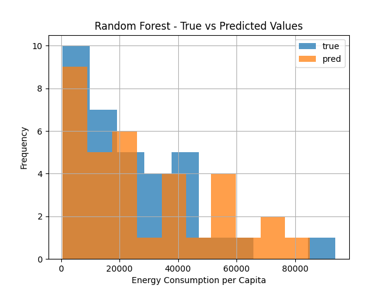

# RESULTS
This section shows how the research answers each research question based on the specific methods.

## Answering Research Question 1:

1. **Research Question:** How do economic factors such as GDP per capita correlate with energy access disparities across different regions?

    **Project Answer:** 

### Visualizations:

*Figure 1:True vs. Predicted Values of the linear regression model predicting the effects of GDP per capita in energy consumption*

*Figure 2: True vs. Predicted Values of the Random Forest regressor model predicting the effects of GDP per capita in energy consumption.*

In the comparison of model predictions with actual energy consumption per capita values, visualized through histograms, significant disparities emerge between the linear regression model and the Random Forest model.The blue histogram represents the actual distribution of energy consumption per capita values, while the orange represents the distribution of predicted energy consumption per capita values generated by each regression model. *Figure 1* (showing the linear regression) shows significant differences between the histograms, such as shifts in the distribution. This indicates that the model's predictions are not accurately capturing the variability present in the true values. In contrast, *Figure 2* shows a close overlap between the histograms, suggesting that the model predictions are aligned well with the true values, indicating a better fit compared to the linear regression. Thus, when predicting Energy Access through economic factors, the Random Forest performs better. 

2. **Research Question:** What factors contribute to the classification of countries into high, medium, and low energy efficiency levels, and can these factors be used to predict a country's energy efficiency?

    **Project Answer:**

### Visualizations:

*Figure 3: Bar chart displaying the importance of each feature (renewable energy share and energy intensity) in the classification model.*

*Figure 4: The confusion matrix visualizes the performance of the classification model.*

 In *figure 4*, each cell in the matrix represents the number of instances where the true rows and the predicted columns coincide. The diagonal elements representing correct predictions show that the Random Forest classifier performs very well in predicting energy efficiency levels based on renewable energy share and energy intensity features. *Figure 3* visualizes the feature's importance. It indicates the contribution of each feature to the prediction accuracy of the model. As higher values indicate more significant contributions, it is clear that the share of renewable electricity is more significant in the model.