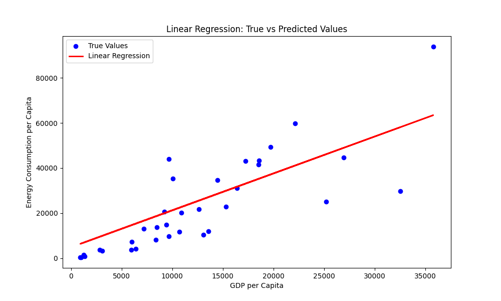
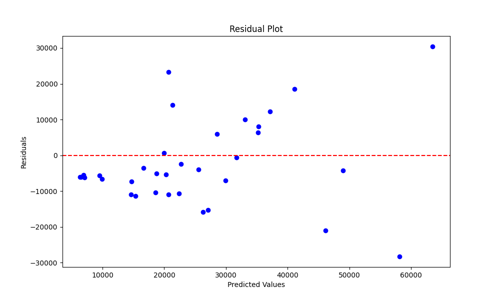

# RESULTS
This section shows how the research answers each research question based on the specific methods.

## Answering Research Question 1:

1. **Research Question:** How do economic factors such as GDP per capita correlate with energy access disparities across different regions?

    **Project Answer:** Yes, the project demonstrates that the XGBoost model has a high prediction accuracy and generalization ability for predicting the risk of type 2 diabetes. The R^2 value indicates a strong fit to the data (the lower the better in this context), which suggests the model can effectively capture the relationship between input features and diabetes risk.

### Visualizations:

2. **Research Question:** What factors contribute to the classification of countries into high, medium, and low energy efficiency levels, and can these factors be used to predict a country's energy efficiency?

    **Project Answer:**