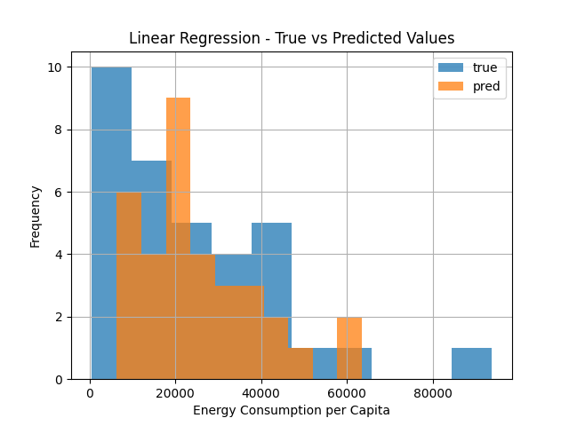
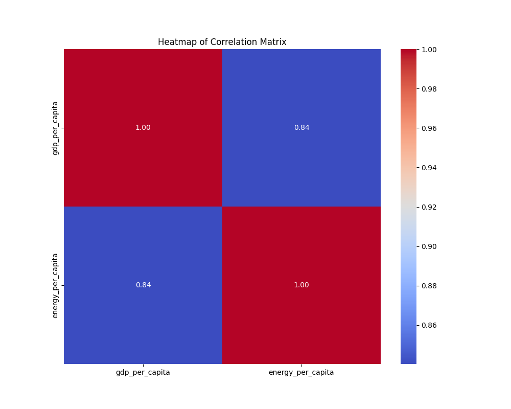
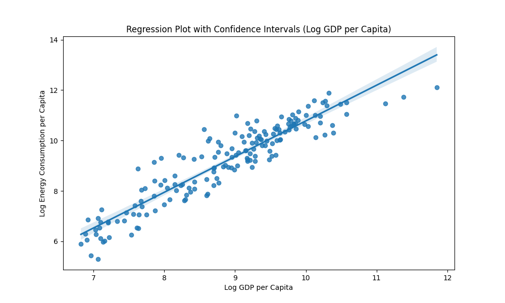
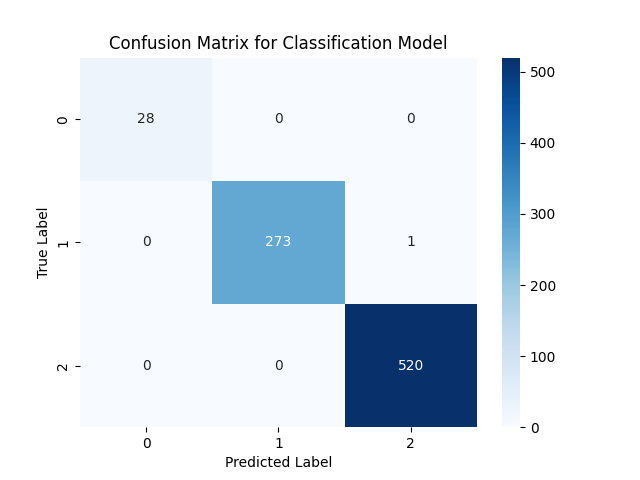
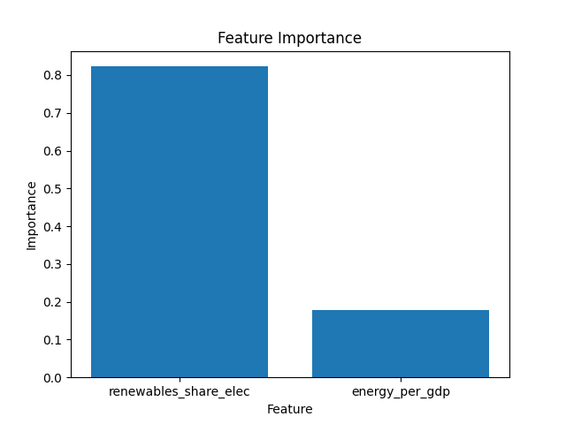
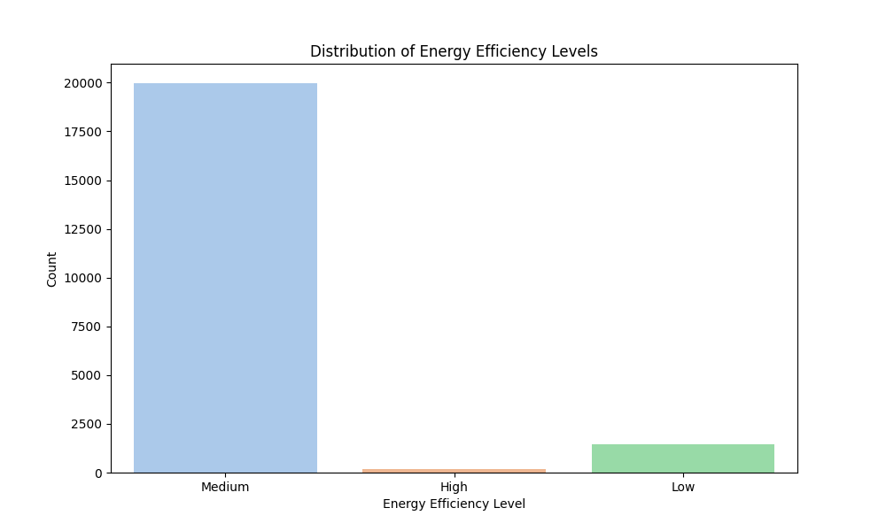

# SPOTLIGHTS
The following page shows all the visualization files from the data analysis of both models; the Regression and Classification. The Regression model includes visualization on the performance of the Linear Regression and the Random Forest regressor, as well as other visualizations regarding the variables in question. The Classification model includes a confusion matrix to visualize the performance of the Random Forest classifier, a feature importance plot to evaluate which feature was most significant in the model, as well as the distribution of the energy efficiency levels into the three classifications.

## Regression Model Visualizations:

## Classification Model Visualizations:

